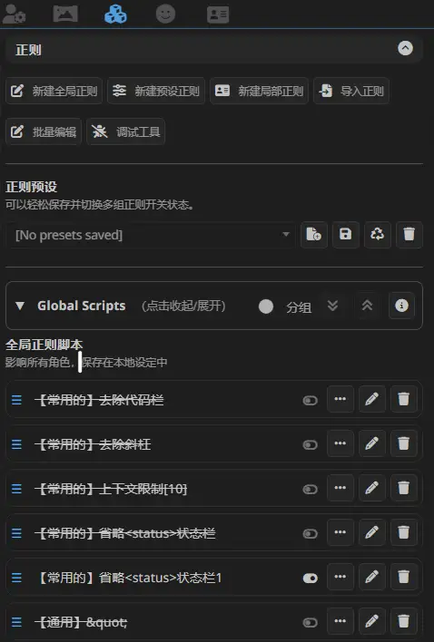

# Regex Global Scripts Collapser

一个**独立的 SillyTavern 前端插件**，用于管理酒馆正则（Regex）界面里的全局正则脚本**Global Scripts** 区域：

1. **Global Scripts 整块可点击收起/展开**
2. **全局正则脚本列表支持按组分类展示与折叠**

> 说明：分组展示仅影响“显示方式”，不改变 SillyTavern 内部的正则执行顺序。

## 功能

### 1) 全局正则折叠



### 2) 分组展示


- 支持根据脚本名**前缀**分组，最多二级：
  - `【常用】阡濯自制` → 组：`常用`
  - `文生图-测试1` → 组：`文生图`
  - `文生图-【常用】测试2` → 组：`文生图 / 常用`
  - `【文生图】常用-测试3` → 组：`文生图 / 常用`
- 分组展示开启时：
  - 仅改变显示（通过 CSS order 排序显示），不会改变酒馆正则的真实顺序
  - **禁用原生拖拽排序**（避免误触）
  - 「未分组」默认排在最前
  - 支持置顶： 一级分组标题右侧有「图钉」置顶按钮，可将该一级分组置顶到前面
  - 一键展开收纳：
    - 「全部展开 / 全部收纳」按钮
    - 「使用说明」按钮

## 自动安装

在酒馆的`安装拓展`界面输入以下url：

```
https://github.com/qianzhuowo/RegexGlobalScriptsCollapser
```

## 手动安装

把整个`st-regex-global-scripts-collapser`文件夹放到：

```text
SillyTavern/public/scripts/extensions/third-party/
```
然后在 SillyTavern 的扩展管理里启用该插件。

## 文件结构：

```text
st-regex-global-scripts-collapser/
├── manifest.json
├── index.js
└── style.css
```
